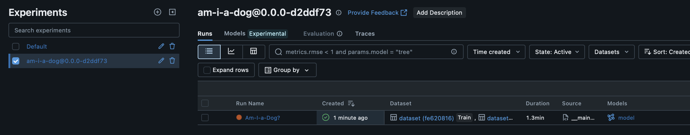

# ml-stack-demp

In this demo, we are going to use the `ml-stack` CLI toolchain to initialize,
manage and deploy the models.

## 1) Init a new Deployment Repo

First up is creating the Deployment repo that will be contain all of the
infrastructure and production code. In this example, the Deployment Project will
be called "demo"

```
(.ml-stack-demo) <computer> ml-stack-demo % ml-stack --init demo
```

<details>
<summary>Output</summary>

```log
[2025-08-01T12:45:24Z DEBUG ml_stack::options::init::project] Creating project folder demo/models
[2025-08-01T12:45:24Z DEBUG ml_stack::options::init::project] Creating project folder demo/config
[2025-08-01T12:45:24Z DEBUG ml_stack::options::init::project] Creating project folder demo/templates
[2025-08-01T12:45:24Z DEBUG ml_stack::options::init::project] Creating project folder demo/templates/docker
[2025-08-01T12:45:24Z DEBUG ml_stack::options::init::project] Initializing default file demo/env.sh
[2025-08-01T12:45:24Z DEBUG ml_stack::mlflow::config::project] Saving Project Configuration into demo/ml.stack.toml
[2025-08-01T12:45:24Z INFO  ml_stack::options::init::project] Successfully initialized a new project folder for demo
```

</details>

After the deployment repository has been initialized, the template structure
looks like:

```bash
(.ml-stack-demo) <computer> ml-stack-demo % cd demo && tree
.
├── config # Model Configuration folder
├── env.sh
├── ml.stack.toml # Deployment Global Configuration
├── models # Model Python Code
├── templates # Template files
│   └── docker
└── terraform # Infrastructure

5 directories, 2 files
```

The global configuration file for this project grouping can be found at
`demo/ml.stack.toml`

```toml
label = "demo"
prefix = "demo"
description = "Placeholder description"

[tag]
key = "project" # ML-Flow tag for every experiment
value = "demo" 

[git]
default_repository_url = "<Default Github Model Repository URL>"

[dockerfile]
default_training = "templates/docker/eval.train"
default_evaluation = "templates/docker/eval.docker"
default_predict = "templates/docker/eval.predict"
```

## 2) Init Demo ML Models

After a blank Project Repository has been generated, we can start adding in new
models that we want to manage. Let's create 2 models, `am-i-a-dog` and
`am-i-a-fish` that will help us determine what is a dog and what is a fish.

```
(.ml-stack-demo) <computer> demo % ml-stack --init --model am-i-a-dog
(.ml-stack-demo) <computer> demo % ml-stack --init --model am-i-a-fish
```

<details>
<summary>Output</summary>

```log
[2025-08-01T12:54:34Z DEBUG ml_stack::options::init::model] Creating model folder /Users/git/ml-stack-demo/demo/models/am_i_a_dog
[2025-08-01T12:54:34Z DEBUG ml_stack::options::init::model] Initializing default file /Users/git/ml-stack-demo/demo/models/am_i_a_dog/main.invoke.py
[2025-08-01T12:54:34Z DEBUG ml_stack::options::init::model] Initializing default file /Users/git/ml-stack-demo/demo/models/am_i_a_dog/main.test.py
[2025-08-01T12:54:34Z DEBUG ml_stack::options::init::model] Initializing default file /Users/git/ml-stack-demo/demo/models/am_i_a_dog/main.train.py
[2025-08-01T12:54:34Z INFO  ml_stack::options::init::model] Successfully added a new project model for am-i-a-dog
```

```log
[2025-08-01T12:54:37Z DEBUG ml_stack::options::init::model] Creating model folder /Users/git/ml-stack-demo/demo/models/am_i_a_fish
[2025-08-01T12:54:37Z DEBUG ml_stack::options::init::model] Initializing default file /Users/git/ml-stack-demo/demo/models/am_i_a_fish/main.invoke.py
[2025-08-01T12:54:37Z DEBUG ml_stack::options::init::model] Initializing default file /Users/git/ml-stack-demo/demo/models/am_i_a_fish/main.test.py
[2025-08-01T12:54:37Z DEBUG ml_stack::options::init::model] Initializing default file /Users/git/ml-stack-demo/demo/models/am_i_a_fish/main.train.py
[2025-08-01T12:54:37Z INFO  ml_stack::options::init::model] Successfully added a new project model for am-i-a-fish
```

</details>

The Deployment Repository now has new configuration files and running scripts
for each of the models.

```
(.ml-stack-demo) <computer> demo % tree
.
├── config
│   ├── am.i.a.dog.toml
│   └── am.i.a.fish.toml
├── env.sh
├── ml.stack.toml
├── models
│   ├── am_i_a_dog
│   │   ├── main.invoke.py
│   │   ├── main.test.py
│   │   └── main.train.py
│   └── am_i_a_fish
│       ├── main.invoke.py
│       ├── main.test.py
│       └── main.train.py
└── templates
    └── docker

7 directories, 10 files
```

Here is the default configuration file for each model:

`demo/config/am.i.a.dog.toml`

```toml
label = "am-i-a-dog" # Model name
description = "Placeholder description"
# TODO: Add GIT-REPO override 
tags = [] #Unique tags for this model

[production]
branch = "<github branch>"
version = "version-tag"

[staging]
branch = "<github branch>"
version = "version-tag"
```

## Create the Model Repository for Am-I-A-Dog?

Now that the Deployment Project has definitions for the models we want to run,
its time to generate the Model code that will run against ML-Flow.

Again, we will use the `ml-stack` toolchain to initialize a new repository.

```
ml-stack --init --model am-i-a-dog --repo
```

<details>
<summary>Output</summary>

```log
am-i-a-dog@0.0.0
[2025-08-01T13:02:23Z DEBUG ml_stack::git] Now checking out am-i-a-dog@0.0.0 (orphan)
--------

--------
[2025-08-01T13:02:23Z DEBUG ml_stack::git] Now checking for uncommitted changes in the active branch
--------

--------
[2025-08-01T13:02:23Z DEBUG ml_stack::options::init::model_in_repository] Skipping README.md
[2025-08-01T13:02:23Z DEBUG ml_stack::options::init::model_in_repository] Skipping .git
[2025-08-01T13:02:23Z DEBUG ml_stack::git] Now committing to git with message 'Initial commit of am-i-a-dog@0.0.0'
--------

--------
--------
[am-i-a-dog@0.0.0 (root-commit) 9045120] "Initial commit of am-i-a-dog@0.0.0"
 3 files changed, 33 insertions(+)
 create mode 100644 README.md
 create mode 100644 requirements.txt
 create mode 100644 src/__main__.py

--------
[2025-08-01T13:02:24Z DEBUG ml_stack::git] Now publishing the branch am-i-a-dog@0.0.0
--------
branch 'am-i-a-dog@0.0.0' set up to track 'origin/am-i-a-dog@0.0.0'.

--------
[2025-08-01T13:02:24Z INFO  ml_stack::options::init::model_in_repository] Successfully established a new model am-i-a-dog under am-i-a-dog@0.0.0
```

</details>

For the sake of flexibility and reducing the total number of GitHub repositories
that are required, every model variant is able to be stored inside the same
Repo. This is possible because `ml-stack` will establish a new orphan Github
branch for each model.

```
(.ml-stack-demo) <computer> ml-stack-demo % git branch
* am-i-a-dog@0.0.0
  am-i-a-fish@0.0.0
  main
```

Now committed in the orphan branch are the following template files:

```
(.ml-stack-demo) <computer> ml-stack-demo % tree
.
├── README.md
├── requirements.txt
└── src
    └── __main__.py

2 directories, 3 files
```

A standard ML-Flow template is now generated and ready to be filled out:

```python
import os
import json
import mlflow
import ml_stack # Custom python library (see `ml-stack-py` branch)


def main():
    ml_stack.setup()

    with mlflow.start_run():
        ml_stack.configure()
        pass


if __name__ == "__main__":
    main()
```

## 3) Experimentation and Model Inception

I will not bore you with this part of the development life-cycle, but in brief a
sample web-service was generated (see the `demo-sample-server` branch) that
returns an ASCII encoded message that we want to predict if the numbers secretly
store a name of a dog.

Model code was then written for building out a Tensorflow ML model and multiple
runs were ran to evaluate a few model options.


Look at that, 40% Accuracy, perfection! I think we are ready to move on and
officially training a model

## 4) Officially Training a Model via GitHub

I don't want to pay for GitHub actions nor could be bothered with setting up the
infrastructure, so again, lets use `ml-stack` to do this for us.

Requesting `--run` with the target GitHub branch, will checkout out our
committed code and build a Docker image for running the official experiment

```
(.ml-stack-demo) <computer> ml-stack-demo % ml-stack --run am-i-a-dog@0.0.0
```

<details>
<summary>Output</summary>

```
[2025-08-01T14:32:28Z INFO  ml_stack::options::experiment] Deploying am-i-a-dog::0.0.0 under demo.am-i-a-dog
[2025-08-01T14:32:28Z DEBUG ml_stack::options::experiment] Working Directory: /var/folders/02/zp9zp9y14fl_sssk_hk7m3dr0000gn/T/.tmpbxig5x
[2025-08-01T14:32:28Z WARN  ml_stack::options::experiment] TODO: Fix the GIT-LIB hard coding
[+] Building 224.0s (18/18) FINISHED
 => [internal] load build definition from Dockerfile
 => => transferring dockerfile: 1.51kB
 => resolve image config for docker-image://docker.io/docker/dockerfile:1
 => [auth] docker/dockerfile:pull token for registry-1.docker.io
 => CACHED docker-image://docker.io/docker/dockerfile:1@sha256:9857836c9ee4268391bb5b09f9f157f3c91bb15821bb77969642813b0d00518d
 => => resolve docker.io/docker/dockerfile:1@sha256:9857836c9ee4268391bb5b09f9f157f3c91bb15821bb77969642813b0d00518d
 => [internal] load metadata for docker.io/library/python:3.12-slim  
 => [auth] library/python:pull token for registry-1.docker.io
 => [internal] load .dockerignore
 => => transferring context: 2B  
 => CACHED [ 1/10] FROM docker.io/library/python:3.12-slim@sha256:9c1d9ed7593f2552a4ea47362ec0d2ddf5923458a53d0c8e30edf8b398c94a31
 => => resolve docker.io/library/python:3.12-slim@sha256:9c1d9ed7593f2552a4ea47362ec0d2ddf5923458a53d0c8e30edf8b398c94a31
 => [ 2/10] RUN apt-get update && apt-get install -y --no-install-recommends git python3-pip && rm -rf /var/lib/apt/lists/* 
 => [ 3/10] RUN python -m venv /opt/venv
 => [ 4/10] RUN mkdir -p /app
 => [ 5/10] WORKDIR /app 
 => [ 6/10] RUN pip install --upgrade pip setuptools wheel build 
 => [ 7/10] RUN git clone --branch ml-stack-py https://github.com/KevinMalm/ml-stack-demo.git /tmp/github-lib && cd /tmp/github-lib && python -m build && pip install dist/*.whl
 => [ 8/10] RUN git clone --branch am-i-a-dog@0.0.0 https://github.com/KevinMalm/ml-stack-demo.git /app
 => [ 9/10] RUN pip install -r requirements.txt 
 => [10/10] RUN GIT_HASH=$(git -C /app rev-parse --short HEAD) && echo "export MLFLOW_EXPERIMENT_NAME=am-i-a-dog@0.0.0-$GIT_HASH" >> /etc/profile.d/mlflow_env.sh 
 => exporting to image  
 => => exporting layers 
 => => exporting manifest sha256:70fd918126c027790ae39dd472daff44433c51c76f8ec8775ffdac0c4ed8f4fa
 => => exporting config sha256:ffc9091a5569e74ed167f5fdef4979f4ecced723e2fec778eb53a588e61c8fa1  
 => => exporting attestation manifest sha256:e1857bbdcff277648de359d3ccfccb5b60552add8bdbf7cb47a8bf04cdade057
 => => exporting manifest list sha256:79209230a90c9cae75eaabfbf68c6ba528babdb302cb67b7ef5d396aeca6dbda
 => => naming to docker.io/library/demo-am-i-a-dog-0.0.0:latest  
 => => unpacking to docker.io/library/demo-am-i-a-dog-0.0.0:latest
```

</details>

After the docker image was built, we will need to run it manually (again because
I am lazy, so 4 GBs?? Wow I am doing something wrong)

I also must note that I cheated a bit here (SORRY!), `ml-stack` handles the
Dockerfile for this step, however this example needs to connect to my dummy API
service (on port 3000), so I hard coded that for all docker images :)


Lets run the Docker image and see what happens!


After running the Docker image, a new Model Group was established that for the
Model under a version and GIT short hash (easily changed, not too sure I like
this grouping approach)




Shown below, the tags set in the Deployment repo feed into the Model tagging


## 5) Lets run it in Staging / Production!

At this point, I ran into a realization that my installation of ML-Flow relies
on direct access to the backend SQLite instance to read / write model weights.
So running these models in local Docker image requires specific mounting. And
that sounds like a lot of work.

To keep things brief, the next steps is to configure the model config with the
latest Run-ID version so each execution knows which artifact to pull from.

```toml
[staging] # or Production
branch = "am-i-a-dog@400.0.0"                # Code version for retraining
version = "2ea2f9acb80a41b1bdd5fc0b771abb88" # Model Weight Version
```

If we wanted to serve this up in Production, we can pass the `version` as a
environment variable

```py
import os
from flask import Flask, jsonify, request
import mlflow

app = Flask(__name__)

model_uri = f"runs:/{os.environ['MODEL-ID']}/model"

MODEL = mlflow.tensorflow.load_model(model_uri) # Load th model here


@app.route("/predict", methods=["POST"])
def get_next():
    global MODEL

    response = {"is_a_dog": MODEL(request.json["content"])}

    return jsonify(response)


if __name__ == "__main__":
    app.run(host="0.0.0.0", port=3000)
```
